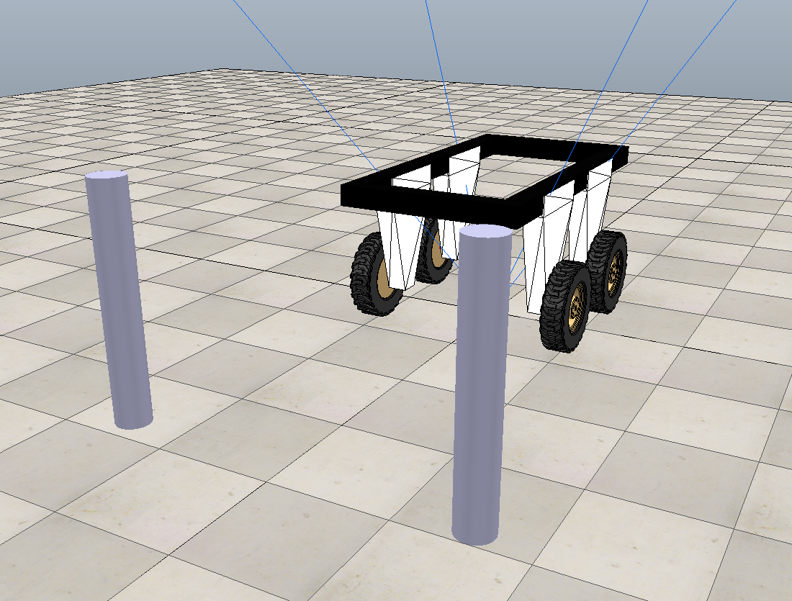
# Autonomous Tractor Parking Simulation
This repository contains the code and simulation models developed as part of my Bachelor of Science disertation on autonomous parking for Amiga farming tractors. It complements my senior thesis paper: 

[_Feedback Control for Autonomous Tractor Navigation_](thesis_paper.pdf)

This research applies nonlinear control theory (using Lyapunov stability principles) and Proportional-Integral (PI) feedback controllers in both MATLAB and CoppeliaSim environments to achieve precise trajectory tracking and parking maneuvers for differential-drive vehicles.

## Project Summary
This thesis has explored the integration and application of nonlinear control
techniques and Proportional-Integral (PI) controllers within a simulated environment
to advance the field of autonomous vehicle navigation. The primary objective was to
develop an effective navigation strategy that enables our farming tractor to perform an
autonomous precise parking maneuver through the dynamic adjustment of its trajectory
and orientation.

---

## Dubins Vehicle Model
I used the Dubins vehicle model as the foundation for simulating the trajectory of an autonomous tractor in 2D space. The Dubins model is a simplified kinematic representation of a non-holonomic vehicle, such as a car or tractor, that moves at a constant forward speed (or bounded speed) and has a bounded turning radius. It is commonly used in path planning and control for ground vehicles where constraints on curvature and orientation apply.

### Vehicle Kinematics
The state of a Dubins vehicle is represented by the tuple ($`x,y,\phi`$), where:
- $`x,y`$: Position in 2D space
- $`\phi`$: Heading angle (orientation with respect to the x-axis)

The vehicle evolves according to the following differential equations:

$`\left[
\begin{aligned} 
\dot{x} &= u \cdot \cos(\phi) \\
\dot{y} &= u \cdot \sin(\phi) \\
\dot{\phi} &= \omega 
\end{aligned}\right]
`$

Where:
- $`u`$: Linear (forward) velocity
- $`\omega`$: Angular (turning) velocity

These equations are implemented in the MATLAB function `car.m`, which is solved over time using `ode45` to simulate motion.

### Why Use the Dubins Model?
This model is ideal for capturing realistic motion constraints of wheeled mobile robots. It's a great tool for evaluating nonlinear controllers (e.g., Lyapunov-based) in trajectory-following tasks, and it simulates behavior without the overhead of full dynamic modeling (e.g., friction, mass, etc.). Its simplicity allows clear analysis of path feasibility, tracking performance, and controller behavior in constrained environments like farming fields.

---

## Control Strategy
### Nonlinear Controller
This control strategy is based on Lyapunov stability analysis, detailed in the paper:

> _Closed-loop steering of unicycle-like vehicles via Lyapunov techniques_

The nonlinear controller used is based on Lyapunov stability analysis. The Lyapunov candidate function is:

$` V = \frac{1}{2} \lambda e^2 + \frac{1}{2} (\alpha^2 + h\theta^2) `$; $`\;`$ $`\lambda, h > 0`$

From this, the control laws are derived as:
- **Linear Velocity Reference**: $` u\_{REF} = \gamma\cos(\alpha) * e`$
- **Angular Velocity Reference**: $` \omega\_{REF} = k\alpha + \gamma\cos(\alpha)(\frac{\sin(\alpha)}{\alpha})(\alpha + h\theta)`$

Where:
- $`e`$: distance to target
- $`\alpha`$, $`\theta`$: orientation error parameters
- $`k`$, $`\gamma`$, $`h`$: tuning constants

These controllers were simulated on a Dubins vehicle model in MATLAB and tested on the tractor model in CoppeliaSim for real-time validation.

### Proportional-Integral (PI) Controllers
The next layer of control involves translating the velocity and turning rate references into actual motor commands. This is achieved through PI (Proportional-Integral) controllers, which are implemented in the `sysCall_actuation()` function.

The **discrete-time** PI control law for each channel is formulated as:

#### Linear Velocity Controller

   The control signal $`u_{V(k)}`$ for velocity is given by: 
   
   $` u_V(k) = K_{p,v} \cdot e_v(k) + K_{i,v} \sum_{j=0}^{k} e_v(j) \cdot T_s + \frac{u_{\text{ref}}(k)}{G_v} `$ 
   
   Where: 
   - $`e_v(k) = u_{\text{ref}}(k) - u_{\text{mes}}(k)`$ is the velocity error at time step $` k `$, 
   - $`K_{p,u}`$, $`K_{i,u}`$ are the proportional and integral gains,
   - $`T_s = 0.05s`$ is the sampling time,
   - $`G_v = 0.2159`$  is the identified plant gain for velocity control,
   - $`\frac{u_{\text{ref}}(k)}{G_v}`$ represents a feedforward component to improve tracking.

Plant Velocity Step Response:

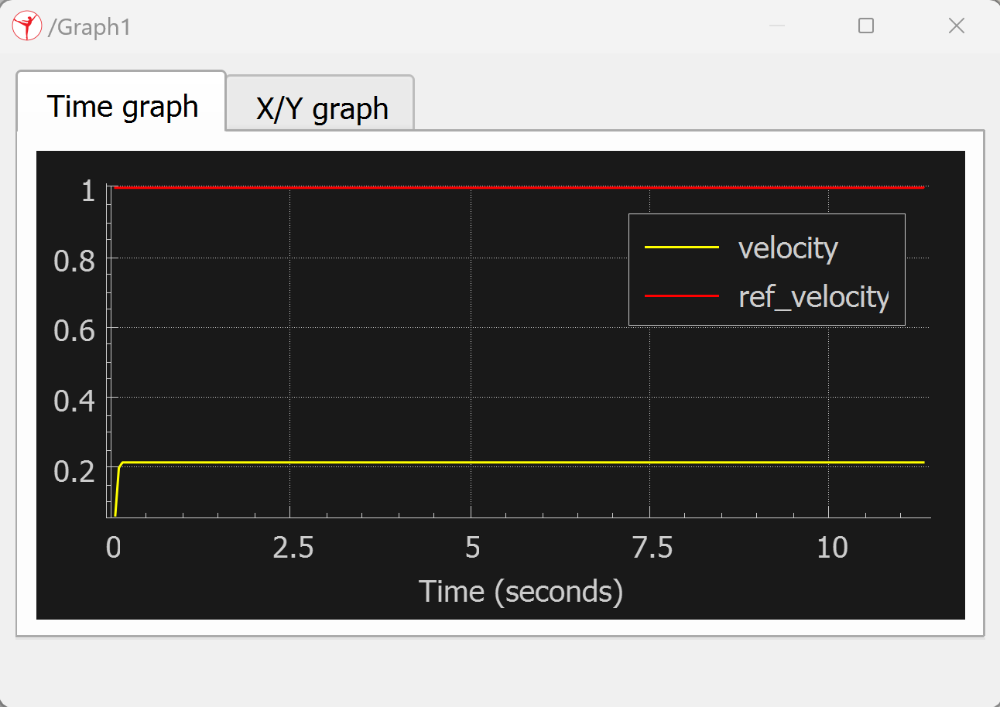

#### Angular Velocity Controller 

   The control signal \( u_\Omega(k) \) for turning rate is given by: 
  
   $` u_\Omega(k) = K_{p,\omega} \cdot e_\omega(k) + K_{i,\omega} \sum_{j=0}^{k} e_\omega(j) \cdot T_s + \frac{\omega_{\text{ref}}(k)}{G_\omega} `$
   
   Where: 
   - $`e_\omega(k) = \omega_{\text{ref}}(k) - \omega_{\text{mes}}(k)`$ is the turning rate error, 
   - $`K_{p,\omega}`$, $`K_{i,\omega}`$ are the PI gains for angular control,
   - $`T_s = 0.05s`$ is the sampling time,
   - $` G_\omega = 0.238`$ is the average plant gain for turning rate (derived from empirical testing). 
   - $`\frac{\omega_{\text{ref}}(k)}{G_\omega}`$ represents a feedforward component to improve tracking.

Plant Turning Rate Step Response:

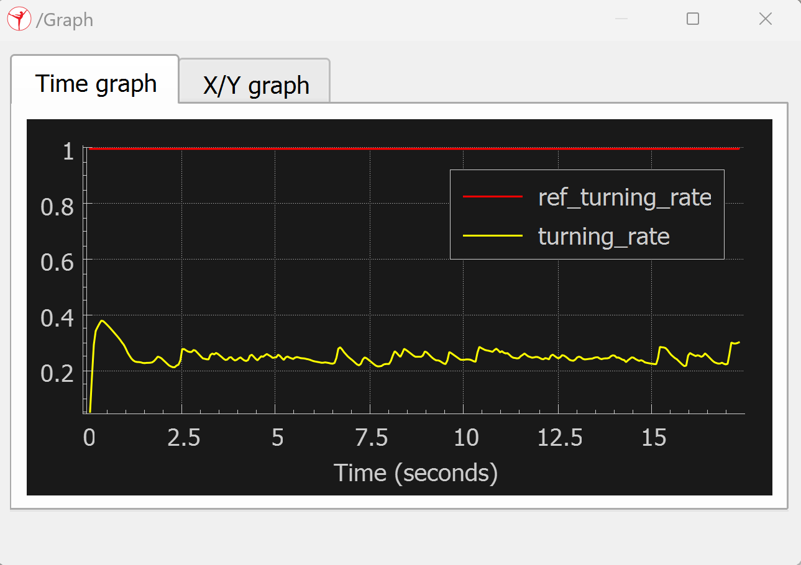

These control laws ensure the system tracks the desired speeds accurately and compensates for steady-state error through integral action.

#### Root Locus-Based Gain Selection
To ensure stability and responsiveness, the PI controller parameters were selected via root locus analysis from the Loop Transfer Function: 

$` L(s) = \frac{K_pG(s+\frac{K_i}{K_p})}{s}; \; CLTF(s) = \frac{sG(s)K_p + G(s)K_i}{s[1+G(s)K_p]+G(s)K_i} `$

This reveals a zero at $`s = -\frac{K_i}{K_p}`$ and a pole at the origin. The gain $`K_p`$ determines how far the closed-loop pole travels along the locus.

To ensure stability and avoid aliasing when using digital control, the Nyquist-Shannon sampling theorem plays a role:
- The sampling frequency should be 6–10× faster than the dominant pole frequency (natural response rate).
- Sampling time $`T_s = 0.05s`$ has a sampling frequency $`f_s = 20Hz`$.
- $`\omega_{sampling} = 2\pi f_s \approx 125.66rad/s`$

Thus, for a sampling time of 50 ms, we desired pole locations around:

$`s \approx −3`$ (i.e., time constant $`\tau = \frac{1}{3}`$ seconds)

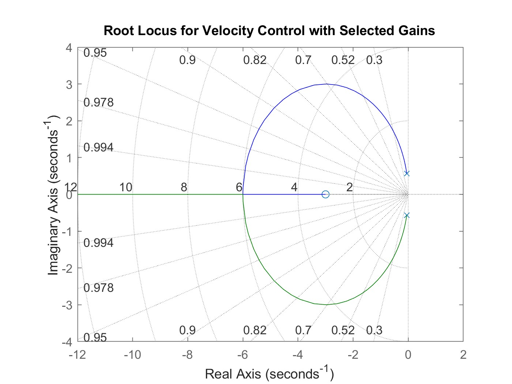

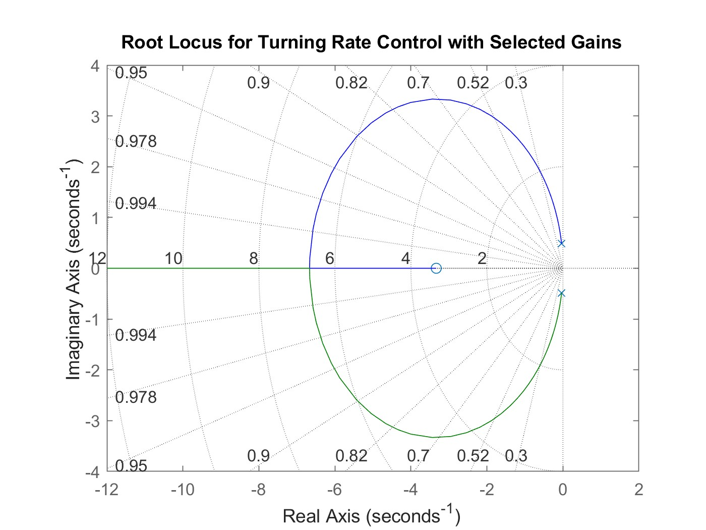

This provides sufficient margin for the controller to track and stabilize the system without introducing numerical errors or aliasing in discrete-time computation.

#### Motor Control Signal Distribution

The two computed control outputs are then combined to set the left and right wheels speeds of the tractor:

$`
\begin{aligned}
v_{left} &= -(u_v - u_\omega) \\
v_{right} &= -(u_v + u_\omega)
\end{aligned}
`$

These are passed to the respective motor joints via `sim.setJointTargetVelocity()` in the actuation script.

---
## File Structure

### MATLAB Simulations

| File         | Description |
|--------------|-------------|
| `unicycle.m` | Main driver script that simulates a unicycle-like Dubins vehicle navigating to a target using nonlinear control. |
| `car.m`      | Defines vehcle kinematics used in the simulation ($`\frac{dx}{dt}`$, $`\frac{dy}{dt}`$, $`\frac{d\phi}{dt}`$). |
| `plotcar.m`  | Visualization helper that plots the current robot state and trajectory. |

### CoppeliaSim Simulations
| File         | Description |
|--------------|-------------|
| `Tractor_Scene.ttt` | The main CoppeliaSim scene file. Includes the environment, robot, gate markers, and associated object configuration. |
| `tractor_controllers`      | Main script attached to the robot or simulation. Contains `sysCall_init()`, `sysCall_actuation()`, `sysCall_sensing()`, and `sysCall_cleanup()` functions implementing the Lyapunov-based nonlinear controller and PI controllers. |
| `trajectory.txt`  | Text file logged during simulation, recording the trajectory of the vehicle (timestamp, X, Y) for further debugging and analysis. |
| `PI.txt` | Performance logging file that stores velocity and turning rate references vs. actual measurements (e.g., `uRef`, `uMes`, `wRef`, `wMes`). |

The Lua control code may be optionally divided into separate files (e.g., `init.lua`, `actuation.lua`, `sensing.lua`) for better modularity and loaded via `require()` or similar techniques.

---

## Output Example

The MATLAB simulation shows the reference trajectory converging to the target pose. You can also compare the reference path with actual trajectory data logged from CoppeliaSim.

### Example 1: 
Trajectory of the Tractor Navigating from Starting Pose $`[0, 0, 180\degree]`$ to Target Pose $`[5, 5, 90\degree]`$ in CoppeliaSim

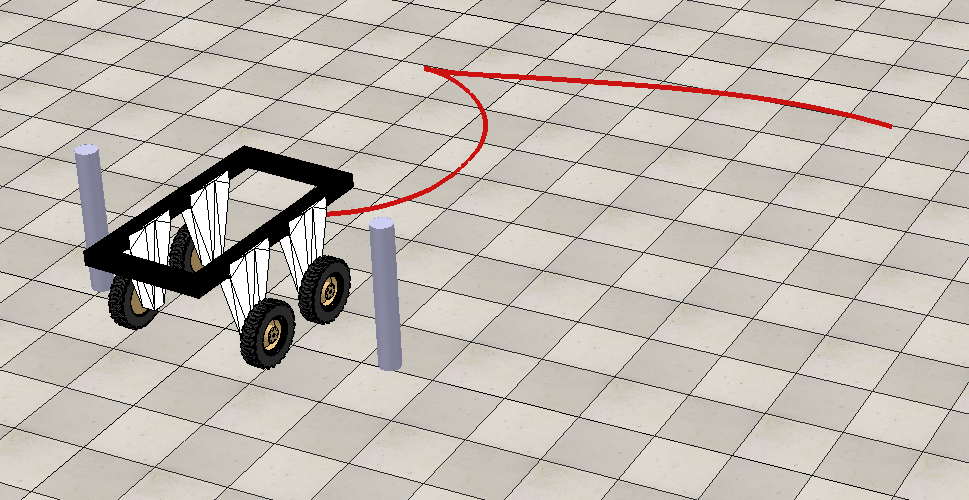

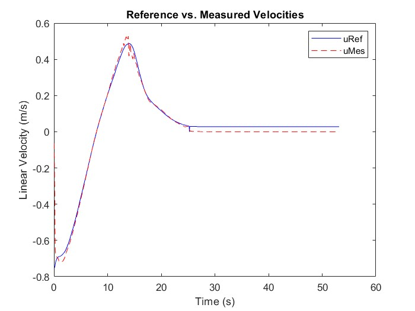 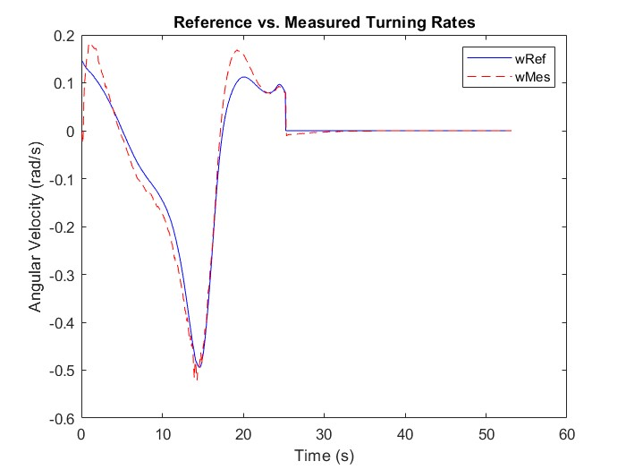

### Example 2: 
Trajectory of the Tractor Navigating from Starting Pose $`[0, 0, 180\degree]`$ to Target Pose $`[0, 5, 45\degree]`$ in CoppeliaSim

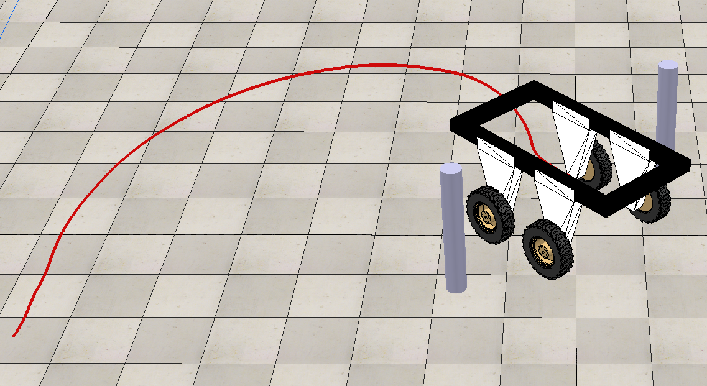

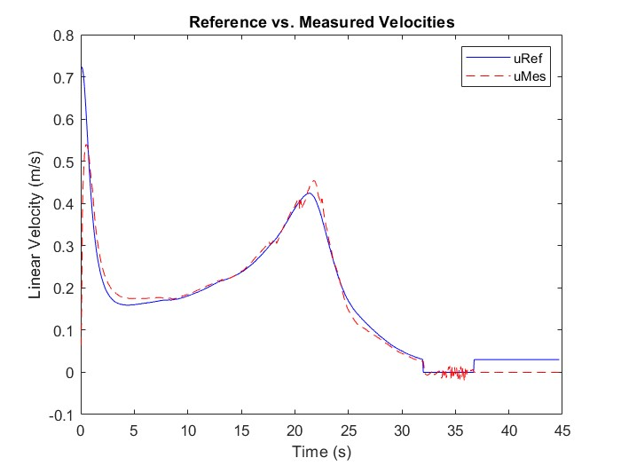 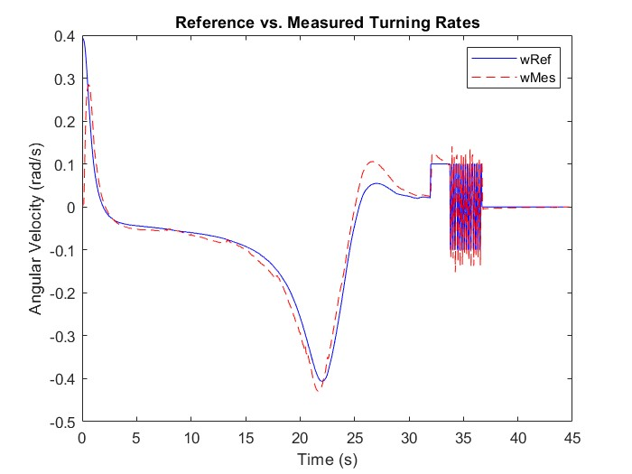

### Example 3: 
Trajectory of the Tractor Navigating from Starting Pose $`[0, 0, 180\degree]`$ to Target Pose $`[3, -3, 90\degree]`$ in CoppeliaSim

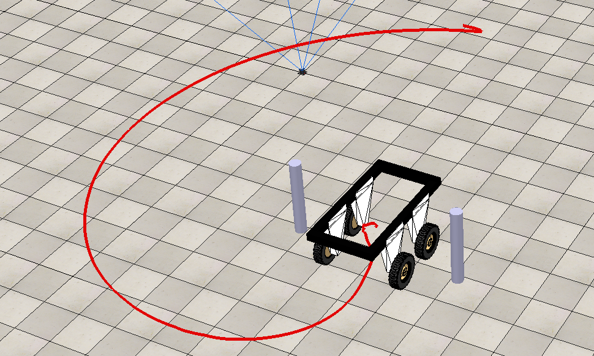

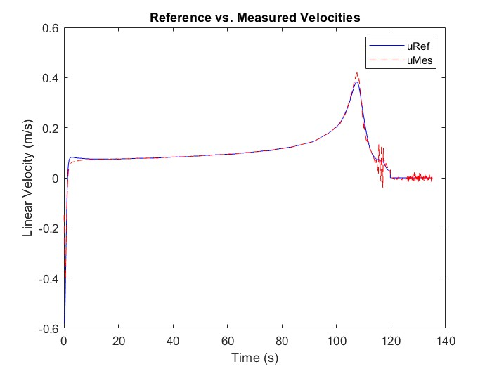 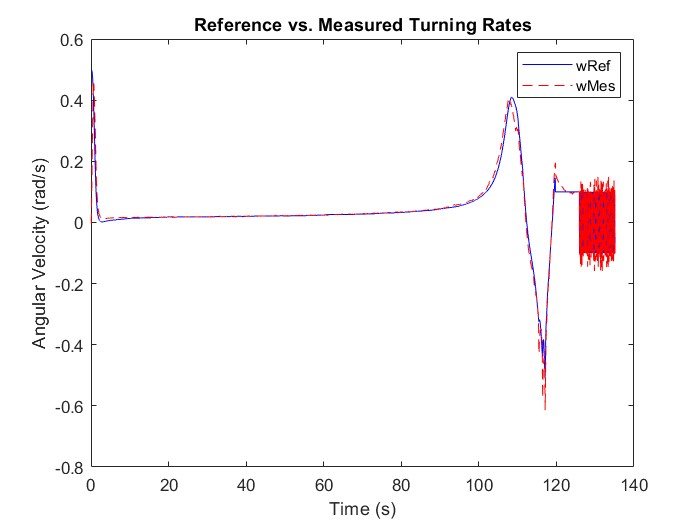

---

## Data Collection and Analysis

In CoppeliaSim, vehicle position and control data are logged in `trajectory.txt` and `PI.txt`. MATLAB scripts are used to:
- Parse the data files
- Compare measured vs reference values
- Evaluate trajectory deviation and system response

---

## References
- Samson, C. (1993). Control of Chained Systems: Application to Path Following and Time-Varying Point-Stabilization of Mobile Robots. INRIA.
- Velagic, J., Osmic, N., & Lacevic, B. (2008). Nonlinear Motion Control of Mobile Robot Dynamic Model.
- Ljung, L. (1999). System Identification: Theory for the User. Prentice-Hall.
- M. Aicardi, G. Casalino, A. Bicchi, and A. Balestrino. Closed loop steering of unicycle like vehicles via lyapunov techniques. IEEE Robotics & Automation Magazine, 2(1):27–35, 1995.
- Peter I. Corke. Robotics, Vision & Control: Fundamental Algorithms in MATLAB. Springer, second edition, 2017. ISBN 978-3-319-54413-7.
- Andreas Folkers, Matthias Rick, and Christof B¨uskens. Controlling an autonomous vehicle with deep reinforcement learning. In 2019 IEEE Intelligent Vehicles Symposium (IV), pages 2025–2031, 2019.
- B Ravi Kiran, Ibrahim Sobh, Victor Talpaert, Patrick Mannion, Ahmad A. Al Sallab, Senthil Yogamani, and Patrick P´erez. Deep reinforcement learning for autonomous driving: A survey. IEEE Transactions on Intelligent Transportation Systems, 23(6):4909–4926, 2022.
- Jaepoong Lee and Seongjin Yim. Comparative study of path tracking controllers on low friction roads for autonomous vehicles. Machines, 11(3), 2023.
- Guo Qing, Zhang Zheng, and Xu Yue. Path-planning of automated guided vehicle based on improved dijkstra algorithm. In 2017 29th Chinese Control And Decision Conference (CCDC), pages 7138–7143, 2017.
- C. Samson and K. Ait-Abderrahim. Feedback control of a nonholonomic wheeled cart in cartesian space. In Proceedings. 1991 IEEE International Conference on Robotics and Automation, pages 1136–1141 vol.2, 1991.
- Moveh Samuel, Mohamed Hussein, and Maziah Binti Mohamad. A review of some pure-pursuit based path tracking techniques for control of autonomous vehicle. International Journal of Computer Applications, 135(1):35–38, 2016.
- Steven H. Strogatz. Nonlinear Dynamics and Chaos. CRC Press Taylor & Francis Group, 6000 Broken Sound Parkway NW, Suite 300, Boca Raton, FL 33487-2742, 2018.
- Jasmin Velagic, Bakir Lacevic, and Nedim Osmic. Nonlinear Motion Control of Mobile Robot Dynamic Model. 06 2008.
- Wikipedia contributors. Bendixson’s inequality — Wikipedia, the free encyclopedia. https://en.wikipedia.org/w/index.php?title=Bendixson%27s_inequality&oldid=1196572784, 2024. [Online; accessed 25-June-2024].
- Wikipedia contributors. Nyquist–shannon sampling theorem — Wikipedia, the free encyclopedia. https://en.wikipedia.org/w/index.php?title=Nyquist%E2%80%93Shannon_sampling_theorem&oldid=1222782688, 2024. [Online; accessed 8-May-2024].
- Fitri Yakub and Yasuchika Mori. Comparative study of autonomous path-following vehicle control via model predictive control and linear quadratic control. Proceedings of the Institution of Mechanical Engineers, Part D: Journal of Automobile Engineering, 229(12):1695–1714, 2015.
- Qin Zou, Qin Sun, Long Chen, Bu Nie, and Qingquan Li. A comparative analysis of lidar slam-based indoor navigation for autonomous vehicles. IEEE Transactions on Intelligent Transportation Systems, 23(7):6907–6921, 2022. 
